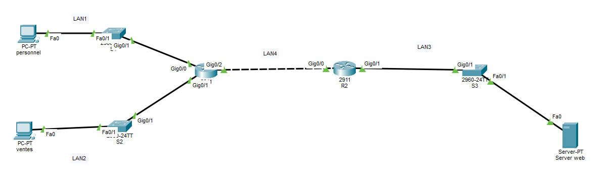

# CCNA1 Network Project

## Overview

This project was developed using Cisco Packet Tracer as part of my CCNA1 studies.

The objective of this project is to build and configure a small enterprise network, configure routers and switches, implement static routing, secure remote access using SSH, and verify end-to-end connectivity between network devices.

---

## Network Topology

---

## Project Features

- Router Configuration
- Switch Configuration
- Static Routing
- SSH Remote Access
- IP Address Configuration
- Routing Table Documentation
- End-to-End Connectivity Testing

---

## Network Devices

| Device | Quantity |
|---------|---------:|
| Cisco Routers | 2 |
| Cisco Switches | 3 |
| PCs | 2 |
| Server | 1 |

---

## Skills Demonstrated

- Cisco IOS CLI
- Basic Network Design
- Router Configuration
- Switch Configuration
- Static Routing
- SSH Configuration
- Network Verification
- Troubleshooting

---

## Project Files

- **CCNA1-Network-Project.pkt** — Cisco Packet Tracer project
- **Project-Documentation.docx** — Routing table and SSH configuration
- **Topology.png.png** — Network topology diagram

---

## Software Used

- Cisco Packet Tracer

---

## Author

**Yasser Grine**

CCNA Student | Networking Enthusiast
